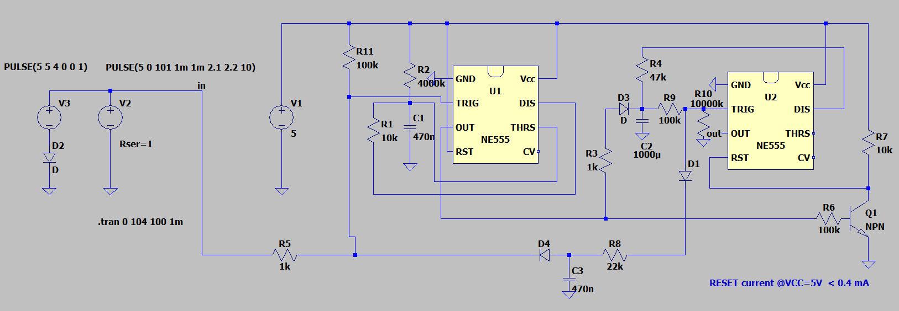

# spice-models
Spice models of devices designed for my private use, that's why they usually lack power supply units/ output stages etc.

## Wyłącznik czasowy do światła

Sterowanie stanem niski na wejściu (zwarciem z masą). Działanie zależy od czasu trwania impulsu wejściowego:
- t < ok. 2s => włączenie światła na 2 min
- t > ok. 2s => światło świeci się dopóki wysterowane jest wejście

Dzięki takiemu sterowaniu poniższy układ może wsółpracować z czujką ruchu, typowymi wyłącznikami, w tym schodowymi. Dużą zaletą układu jest możliwość użytkowania go dokładnie tak jak tradycyjnego, z dodatkową funkcją włączenia światła na czas 2 min poprzez włączenie i wyłączenie wyłącznika. Można także wyłączyć odliczanie włączając wyłącznik na dłużej niż 2 s i wyłączając.

[wylacznik_czasowy_do_swiatla_v3.asc](wylacznik_czasowy_do_swiatla_v3.asc)
